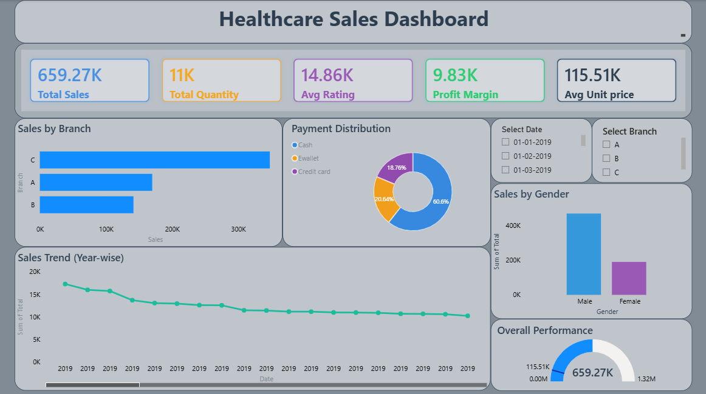

# Healthcare Sales Dashboard (Power BI)

## 📊 Project Overview
This project presents an interactive Healthcare Sales Dashboard built using Power BI to analyze sales performance and business insights.

## 🚀 Key Features
- KPI Tracking (Total Sales, Quantity, Profit Margin, Avg Rating)
- Branch-wise Sales Analysis
- Payment Mode Distribution
- Gender-based Sales Insights
- Yearly Sales Trend Analysis
- Interactive Filters (Date & Branch)

## 🛠 Tools & Technologies
- Power BI
- Excel / CSV Dataset

## 📷 Dashboard Preview

## 📌 Insights
- Branch C has highest sales
- Cash payments dominate transactions
- Sales show gradual decline over time
- Male customers contribute more to sales

## 📎 Files Included
- `.pbix` file (Power BI Dashboard)
- Dataset file
- Dashboard screenshot
